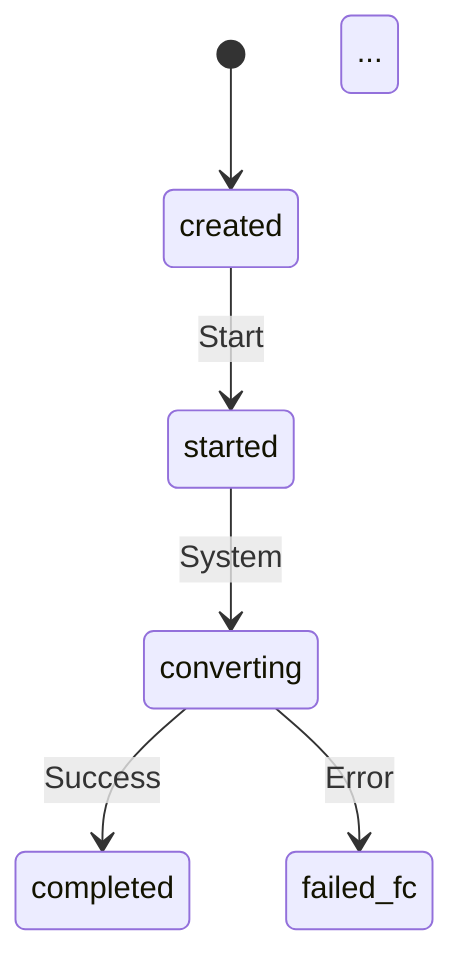
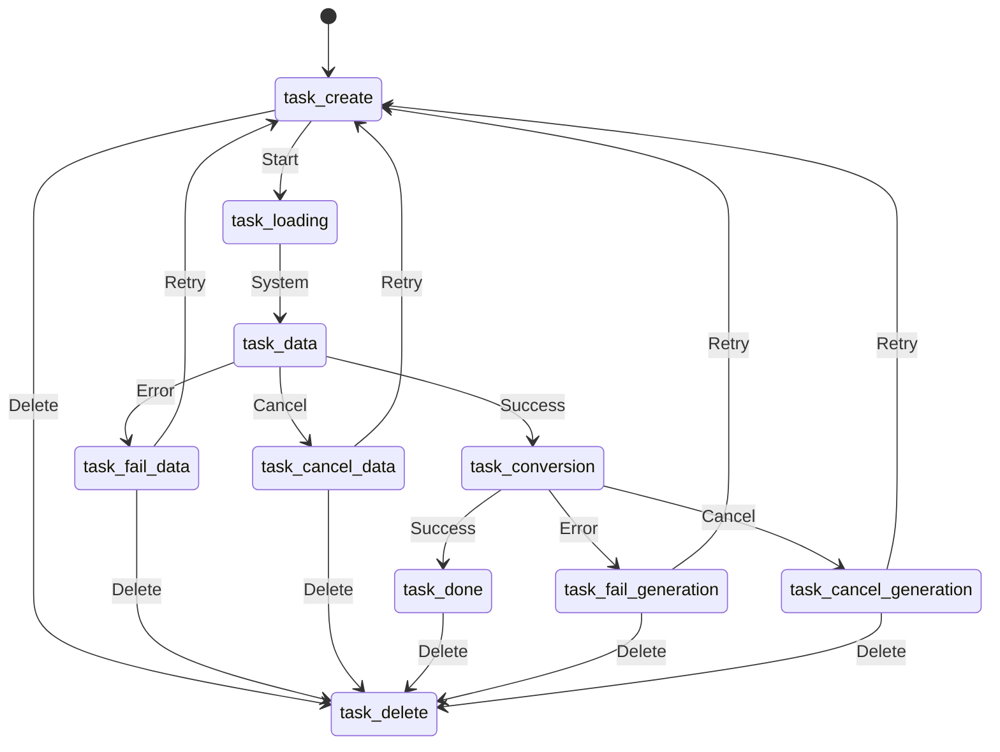

# TASK-032: Составление и документирование статусной модели задания на формирование отчета

**Статус**: 📋 Бэклог  
**Ветка**: `feature/TASK-032-status-model-documentation`

---

## Краткое описание

Составить и задокументировать статусную модель задания на формирование отчета с учетом доступа к операциям «Отмена», «Удаление», «Запуск». Создать подробную документацию, включающую диаграмму переходов между статусами, таблицу разрешений для операций и описание логики работы статусной модели.

---

## Контекст

В системе существует статусная модель для заданий на формирование отчета формы 6406, которая включает 21 статус:
- 10 статусов DAPP (Data Application Processing)
- 11 статусов FC (File Conversion)

Статусная модель уже реализована в коде (`service2110/src/types/status-model.ts`), но отсутствует подробная документация, описывающая:
- Переходы между статусами
- Разрешения на операции (отмена, удаление, запуск) для каждого статуса
- Логику работы статусной модели
- Диаграмму состояний

Необходимо создать полную документацию статусной модели для использования разработчиками и тестировщиками.

---

## Требования

### Документация

1. **Создать документ со статусной моделью** (`docs/status-model.md`):
   - Описание всех 21 статуса с их назначением
   - Группировка статусов по категориям (DAPP, FC)
   - Описание жизненного цикла задания

2. **Создать таблицу разрешений для операций**:
   - Для каждого статуса указать:
     - `canCancel` — можно ли отменить задание
     - `canDelete` — можно ли удалить задание
     - `canStart` — можно ли запустить задание
   - Указать целевой статус после выполнения операции

3. **Создать диаграмму переходов между статусами**:
   - Визуализация возможных переходов между статусами
   - Указание операций, которые вызывают переходы
   - Указание автоматических переходов (системные)

4. **Описать логику операций**:
   - **Отмена (Cancel)**:
     - Какие статусы позволяют отмену
     - В какой статус переходит задание после отмены (`killed_dapp`)
     - Ограничения и условия для отмены
   - **Удаление (Delete)**:
     - Какие статусы позволяют удаление
     - Что происходит при удалении (мягкое/жесткое удаление)
     - Ограничения и условия для удаления
   - **Запуск (Start)**:
     - Какие статусы позволяют запуск
     - В какой статус переходит задание после запуска (`started`)
     - Проверки перед запуском (свободное место в хранилище и т.д.)

5. **Описать системные переходы статусов**:
   - Автоматические переходы между статусами
   - Переходы, инициируемые внешними системами (DAPP, FC)
   - Обработка ошибок и переходы в статусы ошибок

6. **Создать примеры использования**:
   - Примеры типичных сценариев работы с заданиями
   - Примеры обработки ошибок
   - Примеры массовых операций

---

## Текущая реализация

### Статусы (21 статус)

**DAPP статусы (10):**
- `upload_generation` — Генерация выгрузки
- `registered` — Задание зарегистрировано
- `failed` — Ошибка генерации выгрузки
- `upload_not_formed` — Выгрузка не сформирована
- `upload_formed` — Выгрузка сформирована
- `accepted_dapp` — Задание принято к исполнению
- `submitted_dapp` — Задание поставлено в очередь выполнения
- `killed_dapp` — Задание отменено
- `new_dapp` — Задание создано
- `saving_dapp` — Задание сохранено

**FC статусы (11):**
- `created` — Создан отчет
- `deleted` — Отчет удален
- `started` — Отчет запущен
- `start_failed` — Ошибка запуска отчета
- `converting` — Отчет конвертируется
- `completed` — Работа над отчетом завершена (файлы сконвертированы)
- `convert_stopped` — Конвертация остановлена
- `in_queue` — Файлы отчета добавлены в очередь на конвертацию
- `file_success_not_exist` — Отсутствует файл _SUCCESS в папке отчета
- `failed_fc` — Ошибка конвертации файла
- `have_broken_files` — Есть файлы с ошибкой конвертации

### Текущие разрешения (из `status-model.ts`)

Разрешения уже реализованы в `service2110/src/types/status-model.ts` через интерфейс `StatusPermissions`:
- `canCancel` — разрешена ли отмена
- `canDelete` — разрешено ли удаление
- `canStart` — разрешен ли запуск
- `isEndDapp` — признак завершения обработки DAPP
- `isEndFc` — признак завершения конвертации файлов
- `displayName` — отображаемое имя на русском языке

---

## Новая статусная модель (упрощенная)

Статусная модель задания на формирование отчета с учетом доступа к операциям «Отмена», «Удаление», «Запуск».

### Таблица статусов и разрешений

| Код | Название | Отменить | Удалить | Запустить | Финальный статус |
|-----|----------|----------|---------|-----------|------------------|
| `task_create` / `task_created` | Создано | `false` | `true` | `true` | `false` |
| `task_loading` | Готовится к запуску | `false` | `false` | `false` | `false` |
| `task_data` | Выборка данных | `true` | `false` | `false` | `false` |
| `task_fail_data` | Выборка не выполнена | `false` | `true` | `true` | `true` |
| `task_cancel_data` | Выборка данных отменена | `false` | `true` | `true` | `true` |
| `task_conversion` | Генерация | `true` | `false` | `false` | `false` |
| `task_done` | Выполнено | `false` | `true` | `false` | `true` |
| `task_fail_generation` | Генерация не выполнена | `true` | `true` | `true` | `true` |
| `task_cancel_generation` | Генерация отменена | `false` | `true` | `true` | `true` |
| `task_delete` | Удалено | `false` | `false` | `false` | `true` |

### Описание статусов новой модели

1. **`task_create` / `task_created`** — Создано
   - Начальный статус задания после создания
   - Можно удалить и запустить
   - Нельзя отменить (задание еще не запущено)

2. **`task_loading`** — Готовится к запуску
   - Промежуточный статус при подготовке к запуску
   - Все операции заблокированы
   - Системный переход

3. **`task_data`** — Выборка данных
   - Процесс выборки данных для формирования отчета
   - Можно отменить
   - Нельзя удалить или запустить повторно

4. **`task_fail_data`** — Выборка не выполнена
   - Ошибка при выборке данных
   - Финальный статус
   - Можно удалить или запустить повторно

5. **`task_cancel_data`** — Выборка данных отменена
   - Выборка данных была отменена пользователем
   - Финальный статус
   - Можно удалить или запустить повторно

6. **`task_conversion`** — Генерация
   - Процесс генерации отчета
   - Можно отменить
   - Нельзя удалить или запустить повторно

7. **`task_done`** — Выполнено
   - Задание успешно выполнено
   - Финальный статус
   - Можно удалить
   - Нельзя отменить или запустить повторно

8. **`task_fail_generation`** — Генерация не выполнена
   - Ошибка при генерации отчета
   - Финальный статус
   - Можно отменить, удалить или запустить повторно

9. **`task_cancel_generation`** — Генерация отменена
   - Генерация была отменена пользователем
   - Финальный статус
   - Можно удалить или запустить повторно

10. **`task_delete`** — Удалено
    - Задание удалено
    - Финальный статус
    - Все операции заблокированы

### Логика операций для новой модели

**Отмена (Cancel):**
- Доступна для статусов: `task_data`, `task_conversion`, `task_fail_generation`
- При отмене `task_data` → переход в `task_cancel_data`
- При отмене `task_conversion` → переход в `task_cancel_generation`
- При отмене `task_fail_generation` → возможно повторное выполнение

**Удаление (Delete):**
- Доступно для статусов: `task_create`, `task_fail_data`, `task_cancel_data`, `task_done`, `task_fail_generation`, `task_cancel_generation`
- После удаления → переход в `task_delete`
- Удаление возможно только для финальных статусов или начального статуса

**Запуск (Start):**
- Доступно для статусов: `task_create`, `task_fail_data`, `task_cancel_data`, `task_fail_generation`, `task_cancel_generation`
- При запуске `task_create` → переход в `task_loading` → `task_data`
- При повторном запуске из статусов ошибок → переход в `task_loading` → `task_data`

---

## Критерии приёмки

- [ ] Создан документ `docs/status-model.md` с полным описанием статусной модели
- [ ] Создана таблица разрешений для всех статусов (21 статус текущей модели и 10 статусов новой модели)
- [ ] Создана диаграмма переходов между статусами для обеих моделей (Mermaid или изображение)
- [ ] Описана логика операций «Отмена», «Удаление», «Запуск» для обеих моделей
- [ ] Описаны системные переходы статусов
- [ ] Добавлены примеры использования статусной модели
- [ ] Документирована новая упрощенная статусная модель (10 статусов)
- [ ] Указаны различия между текущей и новой моделями
- [ ] Документация согласована с текущей реализацией в коде
- [ ] Документация доступна в репозитории и может быть использована разработчиками

---

## Область изменений

| Файл | Описание |
|------|----------|
| `docs/status-model.md` | Новый документ со статусной моделью |
| `docs/status-model-transitions.md` | Документ с диаграммой переходов (опционально) |

---

## Вне границ данной задачи

- Изменение логики статусной модели в коде
- Добавление новых статусов
- Изменение разрешений для операций
- Реализация новых операций над заданиями
- Интеграция документации в Swagger/OpenAPI

---

## Дополнительные заметки

### Структура документации

Рекомендуемая структура документа `docs/status-model.md`:

1. **Введение**
   - Назначение статусной модели
   - Обзор жизненного цикла задания

2. **Статусы**
   - Описание текущей модели (21 статус: DAPP, FC)
   - Описание новой упрощенной модели (10 статусов)
   - Группировка по категориям
   - Описание каждого статуса
   - Отображаемые имена на русском языке

3. **Таблица разрешений**
   - Таблица со всеми статусами и разрешениями для обеих моделей
   - Сравнительная таблица моделей
   - Описание операций

4. **Операции над заданиями**
   - Отмена (Cancel)
   - Удаление (Delete)
   - Запуск (Start)

5. **Переходы между статусами**
   - Диаграмма переходов
   - Описание системных переходов
   - Описание переходов при операциях

6. **Примеры использования**
   - Типичные сценарии
   - Обработка ошибок

### Диаграмма переходов

Рекомендуется использовать Mermaid для создания диаграммы состояний.

**Текущая модель (21 статус):**

**Новая упрощенная модель (10 статусов):**

### Связь с кодом

Документация должна соответствовать реализации в:
- `service2110/src/types/status-model.ts` — определения статусов и разрешений
- `service2110/src/services/report-6406/tasks.service.ts` — логика операций
- `service2110/src/schemas/report-6406/tasks.schema.ts` — валидация статусов

---

## Связанные задачи и артефакты

- Статусная модель: `service2110/src/types/status-model.ts`
- Сервис заданий: `service2110/src/services/report-6406/tasks.service.ts`
- Эндпоинты операций:
  - `POST /api/v1/report-6406/tasks/cancel` — отмена заданий
  - `DELETE /api/v1/report-6406/tasks` — удаление заданий
  - `POST /api/v1/report-6406/tasks/start` — запуск заданий

